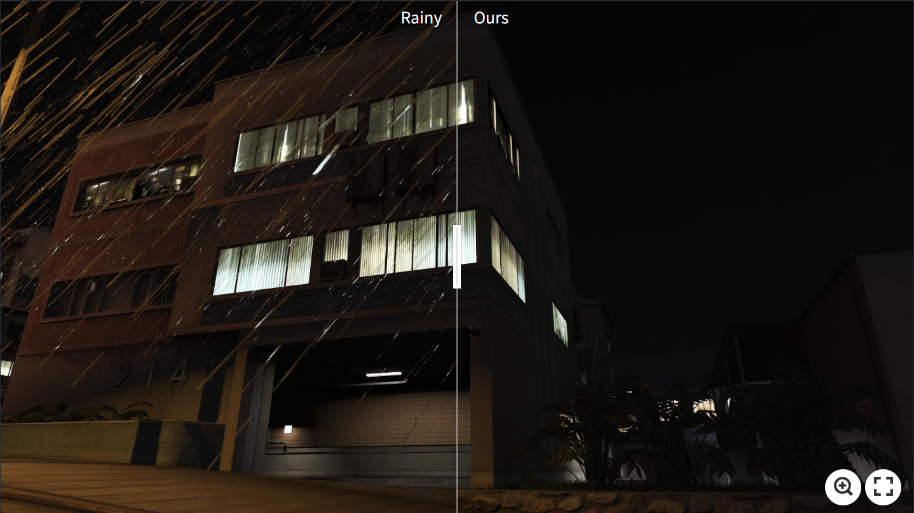
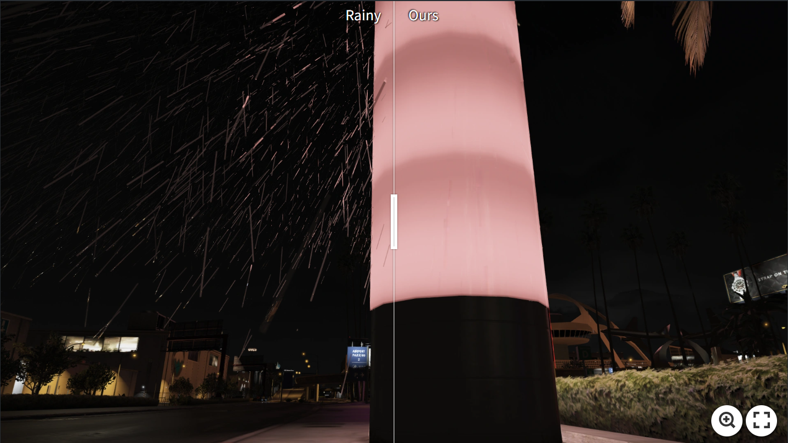

# [TIP2025] NDMamba: Dual-Prior State-Space Model for Nighttime Deraining

## Installation
Setting Up the `Mamba` Environment：  
```
pip install causal_conv1d  
pip install mamba_ssm  
```
Installing the `BasicSR` Library：  
```
python setup.py develop --no_cuda_ext
```
## Datasets
GTAV-NightRain (Rerendered Version) Dataset [link](https://www.kaggle.com/datasets/zkawfanx/gtav-nightrain-rerendered-version)   

Night-Rain Dataset [link](https://drive.google.com/drive/folders/13NHmbws6yMLWi3q7gx5BS-iIQcFYwsYJ?usp=drive_link)    

RealRain-1k Dataset [link](https://drive.google.com/file/d/1x1YuRxsykHlMApne2ErChCJ0DuLiq798/view?usp=drive_link)   

## Pre-trained Models
Pre-trained model for GTAV-NightRain Dataset: [model](https://drive.google.com/file/d/1KjH3lpCxnkL5FFicrvYFLtHK3AudVvk4/view?usp=drive_link)   

Pre-trained model (tiny version) for GTAV-NightRain Dataset: [model](https://drive.google.com/file/d/1id9ajZsjbzA7zP-kW1Sr0_WMlsairQ2s/view?usp=drive_link)   

Pre-trained model for Night-Rain Dataset: [model](https://drive.google.com/file/d/1nWij_Dj0kxquZgPyWLk1HxsdIV-KUFMy/view?usp=drive_link)   

Pre-trained model for RealRain-1k Dataset: [model](https://drive.google.com/file/d/1gCCE3eoaiFuenHSyY1_fps-prCE1xLMd/view?usp=drive_link)    

## Visualization
[](https://imgsli.com/MzgwMTA5)   

[](https://imgsli.com/MzgwMTEw)

## Training
```
python basicsr/train.py -opt NightDeraining/Options/NDMamba_gtav_nightrain.yml     
```
## Test
```
cd NightDeraining
python test.py
```
## Evaluation
```
python eval.py
```

## Acknowledgment
This code is built upon [BasicSR](https://github.com/XPixelGroup/BasicSR), [Restormer](https://github.com/swz30/Restormer), [Mamba](https://github.com/state-spaces/mamba) and [MambaIR](https://github.com/csguoh/MambaIR). Thanks for their work.   
